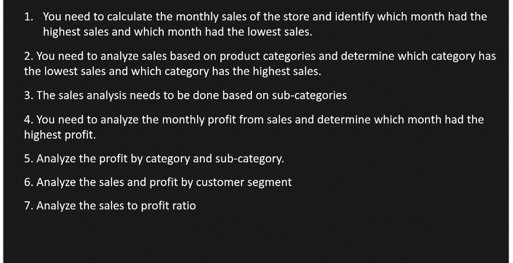

# ecommerce-sales-analysis
Analyzed e-commerce customer purchase behavior using Python, Pandas, NumPy, Matplotlib, and Seaborn. Explored sales trends, customer segmentation, product popularity, order frequency, and seasonal demand to gain business insights and understand real-world patterns.
## 📊 Project Overview
This project analyzes e-commerce customer purchasing behavior using Python. We explore trends in sales, customer segmentation, seasonal demand, and more to extract real-world business insights.

## 🧰 Tools Used
- Python
- Pandas
- NumPy
- Matplotlib
- Seaborn
- Jupyter Notebook

## 🎯 Key Features
- Data cleaning and exploration
- Sales trend visualization
- Customer behavior insights
- Product demand analysis
workflow questions image:

## 🚀 Live Demo
You can try the interactive dashboard here:  
[Streamlit App](https://ecommerce-sales-analysis-hboin34appzsmvmmbaxrssl.streamlit.app/)
